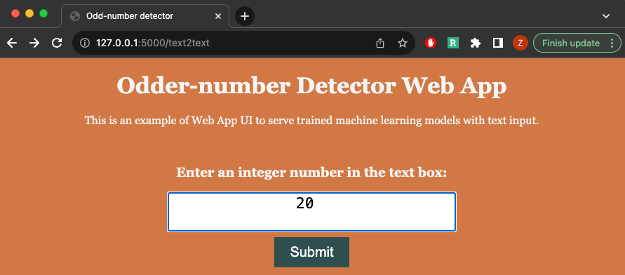
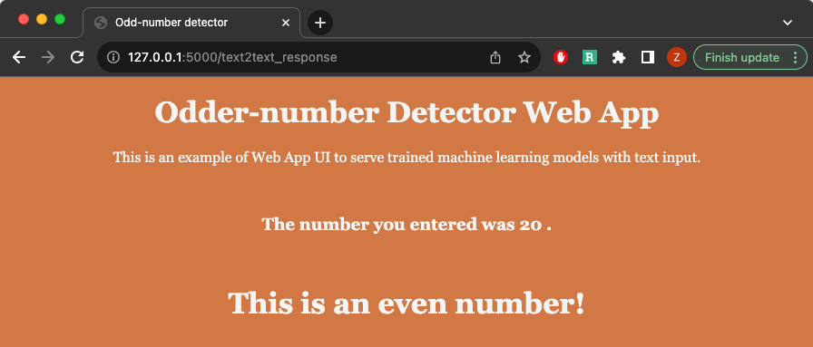
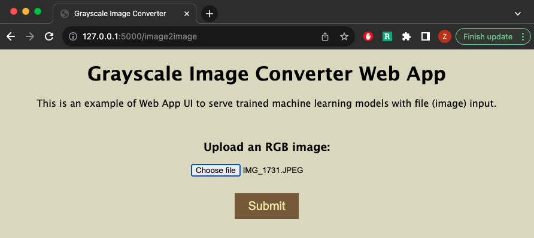
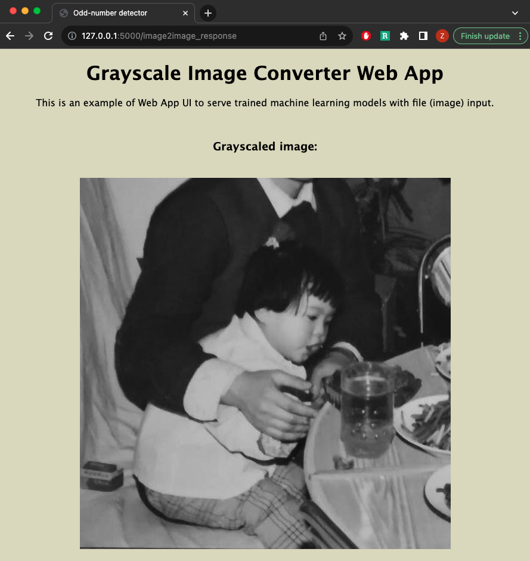

# flask_tutorial_for_data_scientist

This repo contains two type of Flask Web UI templates:

1. text input to text output
    - `text2text.html`
    - `text2text_response.html`

2. image input to image output
    - `image2image.html`
    - `image2image_response.html`

## Text-to-text template (odd-number detector)

Expect a text input

The number entered will be assigned a odd-number or even-number label

## Image-to-image template (grayscale image converter)

Upload an image as input

The output image will be displayed.

### For a step-by-step tutorial, please view my Medium article

[Learn to build Flask API as Data Scientists](https://medium.com/@luzhenna/learn-to-flask-api-as-data-scientists-0b709f667404)
